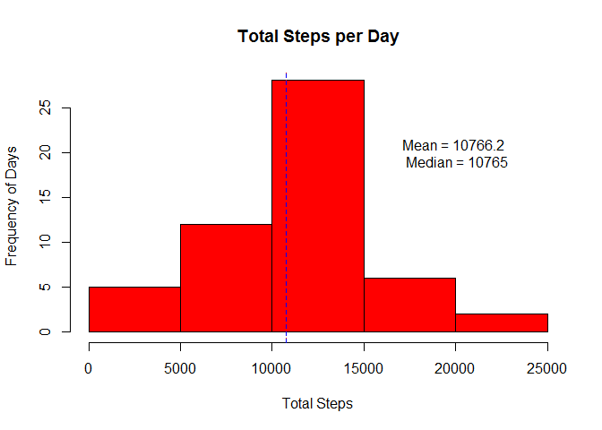
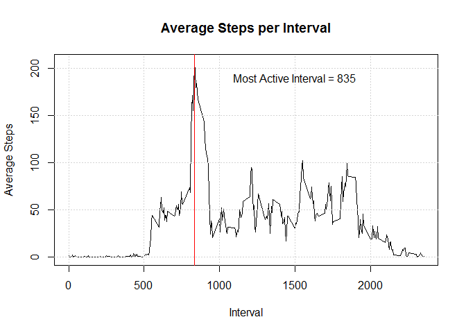
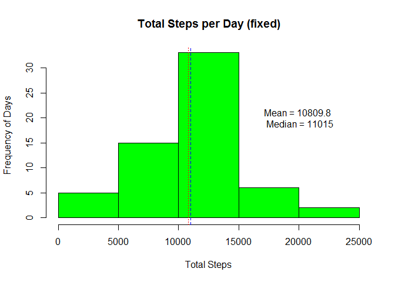
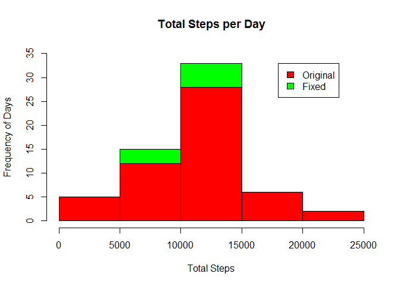
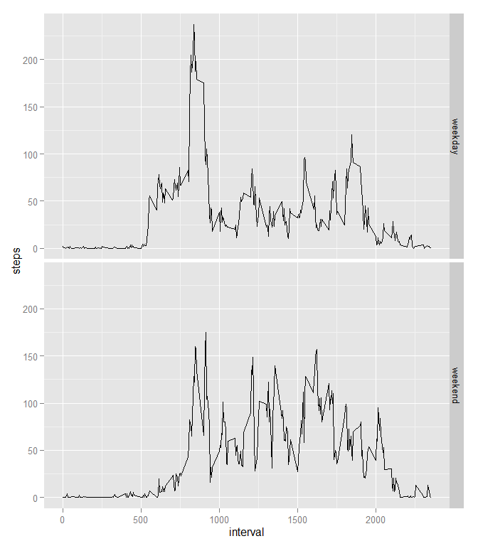

# Reproducible Research: Peer Assessment 1

## Loading and preprocessing the data

Before loading and processing the data we have to verify that the data file is available and download it if necessary.

```r
## Define file names and URL
zipFile <- "repdata_data_activity.zip"
csvFile <- "activity.csv"
fileURL <- "http://d396qusza40orc.cloudfront.net/repdata%2Fdata%2Factivity.zip"

## Check if data files are available
if(!file.exists(zipFile) & !file.exists(csvFile) ){
    ## File not available so download it
    download.file(fileURL, destfile=zipFile, method="auto")
}

## Check if file was unzipped
if(file.exists(zipFile) & !file.exists(csvFile) ){
    ## File not unzipped so unzip
    unzip(zipFile)
}
```
The data file is available so load it and take a look at its structure and content.

```r
## Load activity.csv
activity <- read.csv("activity.csv")

## Look at file structure
str(activity)
```

```
## 'data.frame':	17568 obs. of  3 variables:
##  $ steps   : int  NA NA NA NA NA NA NA NA NA NA ...
##  $ date    : Factor w/ 61 levels "2012-10-01","2012-10-02",..: 1 1 1 1 1 1 1 1 1 1 ...
##  $ interval: int  0 5 10 15 20 25 30 35 40 45 ...
```

```r
## Look at data summary
summary(activity)
```

```
##      steps                date          interval     
##  Min.   :  0.00   2012-10-01:  288   Min.   :   0.0  
##  1st Qu.:  0.00   2012-10-02:  288   1st Qu.: 588.8  
##  Median :  0.00   2012-10-03:  288   Median :1177.5  
##  Mean   : 37.38   2012-10-04:  288   Mean   :1177.5  
##  3rd Qu.: 12.00   2012-10-05:  288   3rd Qu.:1766.2  
##  Max.   :806.00   2012-10-06:  288   Max.   :2355.0  
##  NA's   :2304     (Other)   :15840
```
Preprocess the data and add new columns required for the analisys.

```r
## Cast date from factor to Date
activity$date <- as.Date(activity$date)

## Add a int column for day of the week (0-6 starting on Sunday)
activity$day_of_week <- as.POSIXlt(activity$date)$wday

## Add a factor column for day type (weekday or weekend)
activity$day_type<-factor(activity$day_of_week==0 | activity$day_of_week==6 , labels=c("weekday","weekend"))

## Look at new file structure
str(activity)
```

```
## 'data.frame':	17568 obs. of  5 variables:
##  $ steps      : int  NA NA NA NA NA NA NA NA NA NA ...
##  $ date       : Date, format: "2012-10-01" "2012-10-01" ...
##  $ interval   : int  0 5 10 15 20 25 30 35 40 45 ...
##  $ day_of_week: int  1 1 1 1 1 1 1 1 1 1 ...
##  $ day_type   : Factor w/ 2 levels "weekday","weekend": 1 1 1 1 1 1 1 1 1 1 ...
```

```r
## Look at new data summary
summary(activity)
```

```
##      steps             date               interval       day_of_week
##  Min.   :  0.00   Min.   :2012-10-01   Min.   :   0.0   Min.   :0   
##  1st Qu.:  0.00   1st Qu.:2012-10-16   1st Qu.: 588.8   1st Qu.:1   
##  Median :  0.00   Median :2012-10-31   Median :1177.5   Median :3   
##  Mean   : 37.38   Mean   :2012-10-31   Mean   :1177.5   Mean   :3   
##  3rd Qu.: 12.00   3rd Qu.:2012-11-15   3rd Qu.:1766.2   3rd Qu.:5   
##  Max.   :806.00   Max.   :2012-11-30   Max.   :2355.0   Max.   :6   
##  NA's   :2304                                                       
##     day_type    
##  weekday:12960  
##  weekend: 4608  
##                 
##                 
##                 
##                 
## 
```

## What is mean total number of steps taken per day?
Calculate the total number of steps per day.


```r
## Load dplyr
library(dplyr)
```

```
## 
## Attaching package: 'dplyr'
## 
## The following object is masked from 'package:stats':
## 
##     filter
## 
## The following objects are masked from 'package:base':
## 
##     intersect, setdiff, setequal, union
```

```r
## Summarize the total number steps per day
steps_per_day <- summarize(group_by(activity, date), tot_steps = sum(steps))

## Plot a Histogram of total steps per day
hist(steps_per_day$tot_steps, main="Total Steps per Day", xlab="Total Steps", ylab="Frequency of Days", col="red")

## Calculate mean, median and standard deviation of steps per day
mean_steps <- mean(steps_per_day$tot_steps, na.rm = TRUE)
median_steps <- median(steps_per_day$tot_steps, na.rm = TRUE)

## Add labels to the histogram
text(20000, 20, paste( "Mean =", round(mean_steps, 1), "\n Median =", round(median_steps, 1)))

## Add lines to the histogram
abline(v=mean_steps, col="red", lty=3)
abline(v=median_steps, col="blue", lty=2)
```

 

Analize the mean and median number of steps per day.

```r
## Report on mean and median
paste("The mean number of steps per day is:", round(mean_steps, 2))
```

```
## [1] "The mean number of steps per day is: 10766.19"
```

```r
paste("The median number of steps per day is:", round(median_steps, 2))
```

```
## [1] "The median number of steps per day is: 10765"
```

```r
paste("The distance between mean and median is:", round(abs(mean_steps - median_steps), 2))
```

```
## [1] "The distance between mean and median is: 1.19"
```
The distance between mean and median is very small, only one step over more than ten thousand steps.

## What is the average daily activity pattern?
Calculate the average number of steps taken per interval.

```r
## Summarize the average number steps per interval
steps_per_interval <- summarize(group_by(activity, interval), avg_steps=mean(steps, na.rm = TRUE))

## Plot the average number steps per interval
plot( steps_per_interval$interval, steps_per_interval$avg_steps, type="l"
    , main="Average Steps per Interval", xlab="Interval", ylab="Average Steps")

## Add gridlines to make it easier to read
grid()

## Find the most active interval
most_active_interval <- steps_per_interval[[which.max(steps_per_interval$avg_steps),1]]

## Add labels to the plot
text(1500, 190, paste( "Most Active Interval =", most_active_interval))

## Add line to the plot
abline(v=most_active_interval, col="red")
```

 

Find which interval has the highest average number of steps.

```r
## Report most active interval
paste("The most active interval is:", most_active_interval)
```

```
## [1] "The most active interval is: 835"
```

## Imputing missing values
There are NA values in the steps column so lets take a quick look into it.

```r
## Get count of rows with NA steps
countNA <- sum(is.na(activity$steps))
countNA
```

```
## [1] 2304
```

```r
## Get count of all rows
countAll <- nrow(activity)
countAll
```

```
## [1] 17568
```

```r
## Calculate the precentage of rows with NA steps
countNA / countAll
```

```
## [1] 0.1311475
```
About 13% of the rows have NA values in the steps column. 

To fill in the missing values use the average number of steps per interval and day of the week. By using this method we avoid filling the missing values with values that are too generic.

```r
## Calculate average steps per interval and day of the week
avg_steps_per_interval_and_day_of_week <- summarize( group_by(activity, interval, day_of_week)
                                                   , avg_steps=as.integer(mean(steps, na.rm = TRUE)))

## Merge activity with avg_steps_per_interval_and_day_of_week
activity_fixed <- merge(activity, avg_steps_per_interval_and_day_of_week)

## Fill the NA steps with the corresponding average steps per interval and day of the week
activity_fixed <- mutate(activity_fixed, steps=ifelse(is.na(steps), avg_steps, steps))

## Reorder rows and columns and remove the temporary avg_steps column
activity_fixed <- activity_fixed[order(activity_fixed$date, activity_fixed$interval), c(3,4,1,2,5)]

## Remove row names
row.names(activity_fixed) <- NULL
```
Use the fixed data to calculate the total number of steps per day.


```r
## Summarize the total number steps per day
steps_per_day_fixed <- summarize(group_by(activity_fixed, date), tot_steps = sum(steps))

## Plot a Histogram of total steps per day
hist(steps_per_day_fixed$tot_steps, main="Total Steps per Day (fixed)", xlab="Total Steps", ylab="Frequency of Days", col="green")

## Calculate mean, median and standard deviation of steps per day
mean_steps_fixed <- mean(steps_per_day_fixed$tot_steps)
median_steps_fixed <- median(steps_per_day_fixed$tot_steps)

## Add labels to the histogram
text(20000, 20, paste( "Mean =", round(mean_steps_fixed, 1), "\n Median =", round(median_steps_fixed, 1)))

## Add lines to the histogram
abline(v=mean_steps_fixed, col="red", lty=3)
abline(v=median_steps_fixed, col="blue", lty=2)
```

 
Use the fixed data to analize the mean and median number of steps per day.

```r
## Report on mean and median differences
paste("The fixed mean number of steps per day is:", round(mean_steps_fixed, 2))
```

```
## [1] "The fixed mean number of steps per day is: 10809.79"
```

```r
paste("The original mean number of steps per day was:", round(mean_steps, 2))
```

```
## [1] "The original mean number of steps per day was: 10766.19"
```

```r
paste("The difference between original and fixed mean is:", round(mean_steps_fixed - mean_steps, 2))
```

```
## [1] "The difference between original and fixed mean is: 43.6"
```

```r
paste("The fixed median number of steps per day is:", round(median_steps_fixed, 2))
```

```
## [1] "The fixed median number of steps per day is: 11015"
```

```r
paste("The original median number of steps per day was:", round(median_steps, 2))
```

```
## [1] "The original median number of steps per day was: 10765"
```

```r
paste("The difference between original and fixed median is:", round(median_steps_fixed - median_steps, 2))
```

```
## [1] "The difference between original and fixed median is: 250"
```

```r
paste("The fixed distance between mean and median is:", round(abs(mean_steps_fixed - median_steps_fixed), 2))
```

```
## [1] "The fixed distance between mean and median is: 205.21"
```

```r
paste("The original distance between mean and median was:", round(abs(mean_steps - median_steps), 2))
```

```
## [1] "The original distance between mean and median was: 1.19"
```

```r
paste("The difference between original and fixed mean to median distance is:", 
      round(abs(abs(mean_steps_fixed - median_steps_fixed) - abs(mean_steps - median_steps)), 2))
```

```
## [1] "The difference between original and fixed mean to median distance is: 204.02"
```
The fixed mean value went up by 43.6 and the fixed median value went up by 250. Most notably, the distance between mean and median went from 1.19 up to 205.21, an increase of 204.2.

Compare the original and fixed histograms.

```r
## Create original histogram
h1<-hist(steps_per_day$tot_steps, plot=FALSE)

## Create fixed histogram
h2<-hist(steps_per_day_fixed$tot_steps, plot=FALSE)

## Plot fixed Histogram
plot( h2, col=rgb(0,1,0), xlim=c(0,25000), ylim=c(0,35), 
      main="Total Steps per Day", xlab="Total Steps", ylab="Frequency of Days")  

## Plot original histogram
plot( h1, col=rgb(1,0,0), xlim=c(0,25000), ylim=c(0,35), add=T)  

## Add legend
legend(18000, 33, c("Original","Fixed"), fill=c("red","green"))
```

 

Since we filled the missing values with fairly specific values (average steps by interval and day of the week), the average total number of steps per day did not change. What changed was the frequency of days per total steps. That happened because the the original missing days that were ignored now have data and do count.

## Are there differences in activity patterns between weekdays and weekends?

Use the day type column created during preprocessing to show the different activity patterns of weekdays and weekends.


```r
## Load ggplot2
library(ggplot2)

## Draw two pane plot with mean activity per interval for weekdays and weekends
qplot(interval, steps, data = activity_fixed, stat="summary", fun.y = "mean", geom="line")+facet_grid(day_type ~ .)
```

 

The plots show that on weekends morning activity starts later and is lower than on weekdays, but the remainder of the weekend day shows more and later activity levels than on weekdays.
